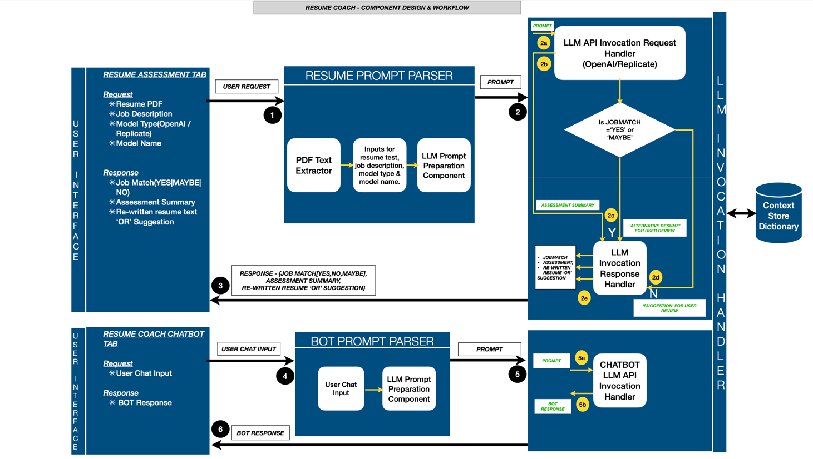

# Resume Coach – System Design

## Overview

**Resume Coach** is a tool that enables users to determine whether a given resume is a good fit for a job posting. It provides an assessment summary by leveraging **LLM and Generative AI technologies**.

Key features include:
- A user-friendly interactive interface
- The ability for users to select the **LLM model type and name**
- A chatbot that supports Q&A-style interaction, bringing together the coaching aspect of the tool

---

## Objectives

- Build a system that can:
  - Compare an individual’s resume to a job posting
  - Assess whether the position is a good fit
  - Identify gaps between the individual’s background and the job requirements
  - Identify unique strengths the individual should emphasize when applying
  - Provide additional coaching advice
- Implement the system as a **web application** that:
  - Accepts a resume and job description as input
  - Produces a coaching report as output
- Enable the system to:
  - Generate a coaching report
  - Chat with the user and answer queries, acting as a personal coach
- Demonstrate the ability to build an application backed by a **Generative AI model**

---

## System Design

### Design Illustration

---

### System Components

1. **Frontend**
   - User interface consisting of two tabs:
     - **User Assessment Tab**
       - Accepts:
         - Resume (PDF format)
         - Job description
         - Model Type (OpenAI / Replicate)
         - Model Name
       - On clicking **Get Assessment**, returns:
         - Classification (`JOB MATCH = YES | MAYBE | NO`)
         - Assessment summary
         - Suggestions or rewritten resume text
     - **ChatBOT Tab**
       - Provides a chatbot interface
       - Allows users to ask questions in the context of the resume and job description
       - Returns coaching advice, answers, and recommendations

2. **Backend**
   - User input request parsers that format input into prompts for LLM invocation
   - LLM Invocation Handler that:
     - Uses prompt templates
     - Invokes LLM models via their APIs

3. **LLM Service**
   - Two separate LLM service wrappers:
     - Resume assessment
     - Chatbot interaction

4. **Storage (Dictionary)**
   - User inputs and LLM responses (assessment, rewrite, suggestions)
   - Stored in a global Python dictionary
   - Acts as a runtime context store across invocation handlers

---

### Key Design Decisions

#### 1. Prompt-Based Evaluation

**Decision:**  
Use structured prompts for resume assessment and coaching.

**Rationale:**
- Enables fast iteration without retraining models
- Clear separation between application logic and prompt behavior

**Alternatives Considered:**
- Rule-based matching (rejected due to rigidity)

---

#### 2. JSON-Only LLM Responses

**Decision:**  
Require strict JSON output from the LLM.

**Rationale:**
- Simplifies parsing and validation
- Enables reliable downstream processing

**Trade-offs:**
- Requires stricter prompt design
- Occasional retries needed for malformed responses

---

#### 3. Zero-Shot vs Few-Shot Prompting

**Decision:**  
- Zero-shot prompts for assessment and rewriting
- Few-shot prompts for chatbot responses

**Rationale:**
- Zero-shot prompts keep requests concise and flexible
- Few-shot prompting improves conversational consistency

---

### Data Flow

1. User submits resume and job description via the **Assessment Tab**
2. Backend validates input
3. Assessment prompt is sent to the LLM
4. Result is parsed and classified
5. Based on classification:
   - **YES** → Feedback
   - **MAYBE** → Suggestions
   - **NO** → Rewrite or guidance
6. User may ask follow-up questions via the **ChatBOT Tab**

---

### Error Handling & Logging

- Modules parse and log erroneous or empty JSON responses
- Defensive parsers clean and validate LLM output
- Prompt templates instruct the LLM to always return JSON
- Chatbot uses few-shot prompting to enforce JSON responses
- Logger configuration writes `logging.info` messages to `app.log`

---

### Security Considerations

- API keys are managed using **environment variables**